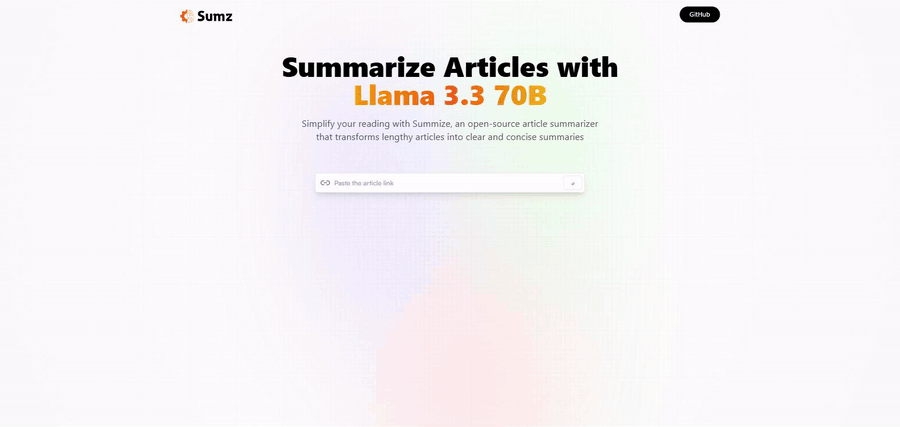

# Summize — AI Article Summarizer

Вставляєш посилання на статтю — отримуєш стислий переказ у три-чотири речення.
Історія запитів зберігається в `localStorage`, тож повторний запит на ту саму
адресу віддається миттєво й без звернення до моделі.



---

## Як це працює

```
браузер ──POST /api/summarize {url}──►  Vercel-функція
                                            │
                                            ├─► r.jina.ai  — витягує текст статті
                                            │
                                            └─► Groq       — llama-3.3-70b-versatile
                                                              віддає переказ
```

Фронтенд: **React 18 + Vite + Redux Toolkit Query + TailwindCSS**.
Бекенд: одна серверлес-функція на **Vercel** (`api/summarize.js`), без бази.

**Ключ живе тільки на сервері.** У попередній версії він був `VITE_`-змінною,
а все з таким префіксом Vite вкомпільовує у клієнтський бандл — тобто ключ було
видно кожному, хто відкриє вихідний код сторінки. Тепер браузер звертається до
власного походження, а до провайдера ходить функція.

---

## Запуск

```bash
npm install
cp .env.example .env      # вписати GROQ_API_KEY
npm run dev               # http://localhost:5173
```

`npm run dev` піднімає і фронтенд, і `/api/summarize`: у `vite.config.js` є
невеликий плагін, який монтує ту саму функцію як middleware. Окремий
`vercel dev` не потрібен, і другої гілки коду для розробки не існує.

| Змінна | Обовʼязкова | Навіщо |
|---|---|---|
| `GROQ_API_KEY` | так | Ключ [Groq](https://console.groq.com/keys) — безкоштовно, ~14 400 запитів/добу, без картки |

Версія Node зафіксована в `engines.node` — 22.x. Vercel читає це поле і воно
перекриває вибір у налаштуваннях проєкту, тож версія збірки лежить у
репозиторії, а не в чиємусь UI-стані, який може тихо застаріти.

---

## Чому саме так

**Groq, а не платний провайдер.** Проєкт до цього ходив у сумаризатор на
RapidAPI. Той перестав працювати, коли в його власника скінчився баланс — і
додаток показував користувачеві чужу помилку про кредити. Groq має
безкоштовний тір, якого для демо вистачає з запасом, і OpenAI-сумісний API.

**r.jina.ai для читання сторінок.** Витягти основний текст зі сторінки —
окрема задача, і робити її самому означає боротися з розміткою кожного сайту.
Reader повертає готовий текст, не потребує ключа, і його легко замінити, бо він
схований за однією функцією.

**Обмеження на 24 000 символів** перед відправкою в модель: довга сторінка
інакше впирається в контекст і робить запит помітно повільнішим.

**Перевірка адреси перед запитом.** Функція ходить у мережу за посиланням, яке
дав користувач. Без перевірки її можна попросити постукати на `localhost` чи у
внутрішню підмережу — класичний SSRF. `assertPublicHttpUrl()` пропускає лише
публічні `http`/`https`.

---

## Обмеження

- **Немає тестів.** Найкорисніші були б на `assertPublicHttpUrl()` — вона
  чиста, детермінована й саме та частина, де помилка коштує дорого.
- **Немає кешу на сервері.** `localStorage` рятує лише того самого користувача
  в тому самому браузері; двоє людей з однаковим посиланням дадуть два запити.
- **Немає обмеження частоти.** Ендпоінт відкритий, і квоту Groq можна вичерпати
  зовнішніми запитами. Для публічного демо цього достатньо, для чогось
  серйознішого — потрібен ліміт за IP.
- **Якість переказу не виміряна.** Немає набору статей з еталонними переказами,
  тож «добре сумаризує» — це спостереження, а не результат.

---

## Структура

```
api/summarize.js        Serverless-функція: перевірка URL, читання статті, виклик Groq
src/services/article.js RTK Query: один POST до /api/summarize
src/components/Demo.jsx Форма, історія в localStorage, стани завантаження й помилки
src/components/Hero.jsx Шапка
vite.config.js          Плагін, що монтує функцію в dev-сервер
docs/demo.gif           Запис роботи
```

## Деплой

Vercel підхоплює проєкт без конфігурації: Vite збирається як статика, усе з
теки `api/` стає функціями. Єдине, що треба зробити руками — додати
`GROQ_API_KEY` у **Settings → Environment Variables**.
